# Event Management Portal (CCGNDEC) — System Architecture & User Guide

> **Official Portal of the Cultural Committee, Guru Nanak Dev Engineering College, Ludhiana**  
> *A comprehensive, real-time platform for organizing college events, managing multi-day Youth Festivals, coordinating faculty & student committees, tracking attendance, handling sponsorships, and exporting official reports.*

---

## Table of Contents
1. [System Overview & Purpose](#1-system-overview--purpose)
2. [Architecture & Data Flow](#2-architecture--data-flow)
3. [Technology Stack](#3-technology-stack)
4. [User Roles & Access Control (RBAC)](#4-user-roles--access-control-rbac)
5. [Core Modules & Operational Workflows](#5-core-modules--operational-workflows)
   - [5.1 Authentication & Account Approval](#51-authentication--account-approval)
   - [5.2 Home Dashboard & Event Hub](#52-home-dashboard--event-hub)
   - [5.3 Event Details & Operations Hub](#53-event-details--operations-hub)
   - [5.4 Committee Meetings & Attendance Tracker](#54-committee-meetings--attendance-tracker)
   - [5.5 Teams & Committee Management](#55-teams--committee-management)
   - [5.6 Faculty & Teacher In-Charges](#56-faculty--teacher-in-charges)
   - [5.7 Sponsorship & Budget Management](#57-sponsorship--budget-management)
   - [5.8 Competition Participants (Regular Events)](#58-competition-participants-regular-events)
   - [5.9 Youth Festival Host Operations (Full Scale)](#59-youth-festival-host-operations-full-scale)
   - [5.10 Youth Festival Contingent Operations](#510-youth-festival-contingent-operations)
   - [5.11 Automated PDF Report & Performa Engine](#511-automated-pdf-report--performa-engine)
   - [5.12 Notification System & Mobile Drawer](#512-notification-system--mobile-drawer)
   - [5.13 Broadcast Email Center](#513-broadcast-email-center)
   - [5.14 Event Calendar & Timeline](#514-event-calendar--timeline)
   - [5.15 Activity Logs & Audit Trail](#515-activity-logs--audit-trail)
   - [5.16 Productivity Tools (Command Palette, Dark Mode, PWA)](#516-productivity-tools-command-palette-dark-mode-pwa)
6. [Master Screenshot Guide & Asset Index](#6-master-screenshot-guide--asset-index)

---

## 1. System Overview & Purpose

The **Event Management Portal - CCGNDEC** is designed to eliminate paperwork, streamline logistics, and provide end-to-end transparency for all cultural and academic festivities organized at GNDEC Ludhiana.

### Key Capabilities:
- **Dual-Mode Event Engine**: Custom workflows for single-day/regular college events vs. massive multi-day inter-college **Youth Festivals** (both GNDEC as **Host College** and GNDEC as an outward **Contingent**).
- **Automated Verification & Audit Trail**: Real-time Firestore listeners, instant local caching (`dataCache.js`), and immutable activity logs recording every edit and approval.
- **Dynamic PDF Publishing**: One-click official report generation (`jsPDF` + `jspdf-autotable`) producing signed, structured rosters for college administration.
- **Progressive Web App (PWA)**: Installable on iOS, Android, macOS, and Windows with offline caching and responsive mobile bottom sheets.

---

## 2. Architecture & Data Flow

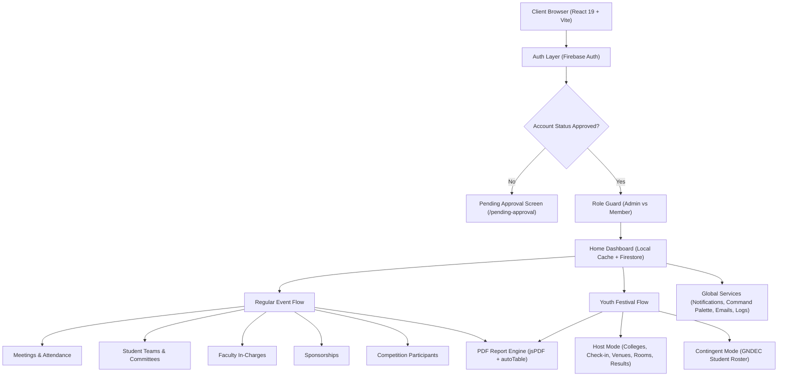

---

## 3. Technology Stack

| Layer | Technologies Used |
| :--- | :--- |
| **Frontend Framework** | React 19, Vite, React Router DOM v7 |
| **UI Components & Styling** | React-Bootstrap 2, Bootstrap 5.3, Bootstrap Icons, Custom Glassmorphic & Soft-UI CSS |
| **Backend & Database** | Firebase Authentication, Cloud Firestore (Real-time DB) |
| **Report Generation** | jsPDF, jspdf-autotable |
| **Email Service** | EmailJS Browser SDK |
| **Excel & Data Processing** | read-excel-file |
| **Performance & Caching** | LocalStorage TTL Cache (`dataCache.js`), Vite Fast Refresh |

---

## 4. User Roles & Access Control (RBAC)

The portal implements strict role-based gating through [`AuthRoute.jsx`](file:///d:/Sem-8/gndec-reports/src/components/AuthRoute.jsx):

```
┌─────────────────────────────────────────────────────────────┐
│                       SUPER ADMIN                           │
│  Full system access, promote/demote admins, delete events   │
└──────────────────────────────┬──────────────────────────────┘
                               │
┌──────────────────────────────▼──────────────────────────────┐
│                          ADMIN                              │
│  Create/Edit/Delete events, manage users, view audit logs   │
└──────────────────────────────┬──────────────────────────────┘
                               │
┌──────────────────────────────▼──────────────────────────────┐
│                    MEMBER / COORDINATOR                     │
│  Manage assigned events, mark attendance, enter results     │
└──────────────────────────────┬──────────────────────────────┘
                               │
┌──────────────────────────────▼──────────────────────────────┐
│                       PENDING USER                          │
│  Registered account waiting for admin approval              │
└─────────────────────────────────────────────────────────────┘
```

- **Pending Users**: Restricted to `/pending-approval` until an administrator approves their request in the User Management console.
- **Committee Members**: Can manage assigned events, student participants, meetings, and view notifications.
- **Administrators**: Can create, edit, and delete events, approve new members, access `/users` and `/activity-logs`.

---

## 5. Core Modules & Operational Workflows

### 5.1 Authentication & Account Approval
Users sign up with their official college credentials. New accounts are quarantined in a `pending` state until verified by a Cultural Committee administrator.

> 📸 **SCREENSHOT PLACEHOLDER 1: Login & Authentication Screen**  
> 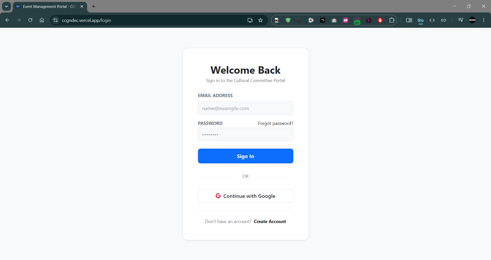  
> *Capture the `/login` page showing the email/password form, branding logo, and link to sign up.*

> 📸 **SCREENSHOT PLACEHOLDER 2: Pending Approval Notice**  
> 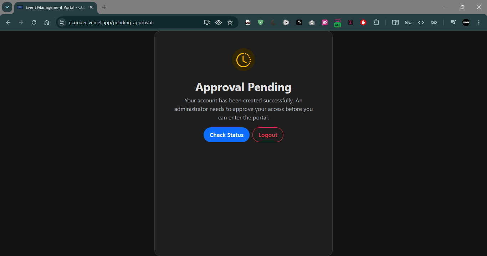  
> *Capture the `/pending-approval` screen displayed to newly registered users awaiting verification.*

> 📸 **SCREENSHOT PLACEHOLDER 3: User Management Console (`/users`)**  
> 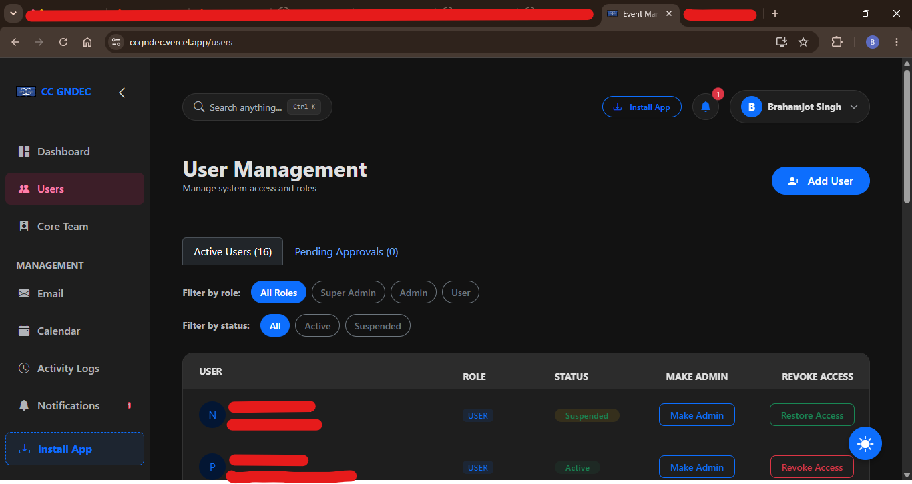  
> *Capture the `/users` table showing the Pending Approvals queue with Approve/Reject buttons and Role selection.*

---

### 5.2 Home Dashboard & Event Hub
The landing page (`/`) centralizes all events in the system.

- **Smart Filter Tabs**: Filter instantly between *All Events*, *Youth Festivals*, *Regular Events*, *Upcoming*, and *Completed*.
- **Search Engine**: Real-time filtering by title or venue.
- **Admin 3-Dots Menu**: Positioned on the top-right of each event card (`soft-card`), allowing administrators to **Edit Event** or **Delete Event**.
- **Dual-Mode Modal**: Create new events or edit existing events. When editing, the Youth Festival switch is locked to protect underlying subcollections.

> 📸 **SCREENSHOT PLACEHOLDER 4: Home Dashboard & Event Cards Grid**  
> 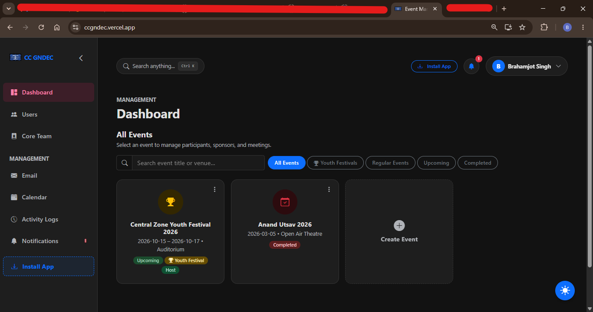  
> *Capture the Home page (`/`) showing the search bar, filter buttons, metric cards, and the grid of event cards.*

> 📸 **SCREENSHOT PLACEHOLDER 5: Event Card Admin 3-Dots Dropdown**  
> 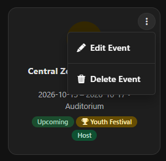  
> *Capture an event card with the 3-dots dropdown menu open, highlighting "Edit Event" and "Delete Event".*

> 📸 **SCREENSHOT PLACEHOLDER 6: Create / Edit Event Modal**  
> 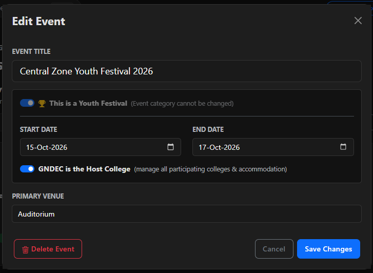  
> *Capture the modal dialog showing event title, date range picker, venue, and Youth Festival configuration.*

---

### 5.3 Event Details & Operations Hub
Clicking any card on the dashboard opens the dedicated Event Workspace (`/event/:id`).

- **Header Controls**: Title, date formatting, venue badge, **Edit Event** button (for admins), **Upload Proof Link**, and **Export Event Report**.
- **Module Grid**: Soft-UI cards routing directly into specialized sub-modules.

> 📸 **SCREENSHOT PLACEHOLDER 7: Event Dashboard Workspace**  
> 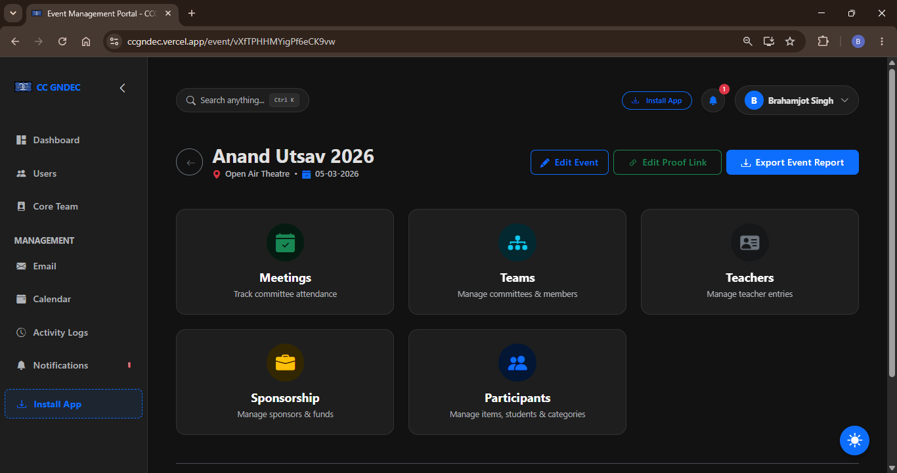  
> *Capture the top banner with the "Edit Event" button and the navigation cards for Meetings, Teams, Teachers, and Sponsors.*

---

### 5.4 Committee Meetings & Attendance Tracker
Organizers schedule preparatory meetings and record attendance per student/committee with timestamps and agendas.

> 📸 **SCREENSHOT PLACEHOLDER 8: Meetings & Attendance Screen**  
> 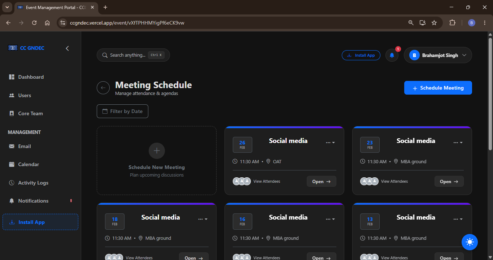  
> *Capture the meeting cards showing date, venue, agenda summary, and the student attendance checklist.*

---

### 5.5 Teams & Committee Management
Allows structuring student volunteers into functional sub-committees (e.g., *Stage Decoration*, *Discipline*, *Sound & Light*, *Refreshments*) with Student Heads and Members.

> 📸 **SCREENSHOT PLACEHOLDER 9: Teams & Student Committees**  
> 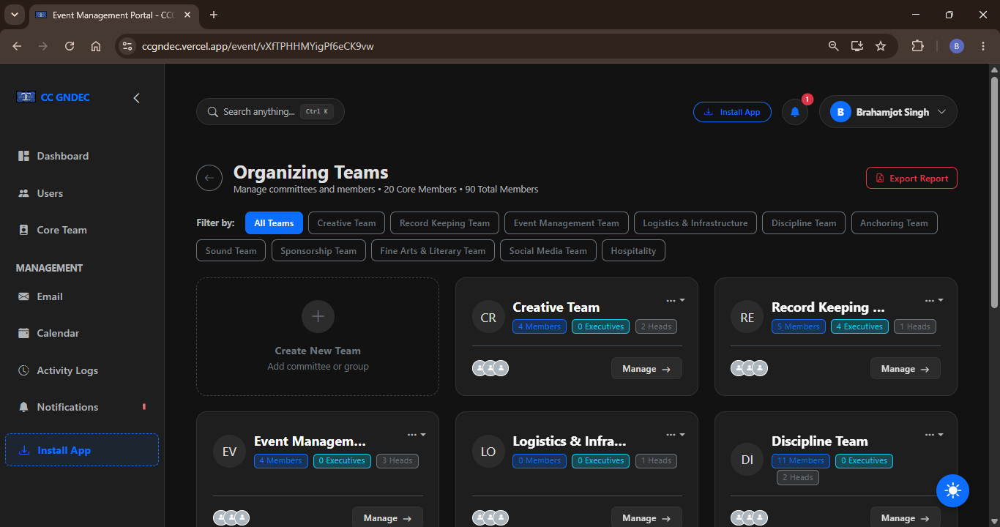  
> *Capture the team cards displaying committee names, student head avatars, member lists, and role tags.*

---

### 5.6 Faculty & Teacher In-Charges
Tracks faculty coordinators, organizing committee in-charges, department representatives, and administrative contacts.

> 📸 **SCREENSHOT PLACEHOLDER 10: Faculty Coordinators Directory**  
> 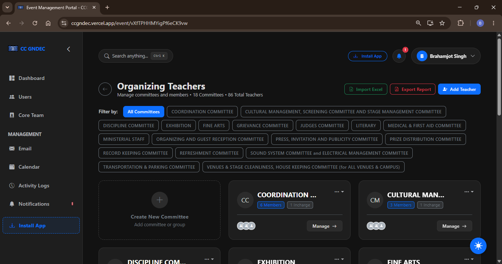  
> *Capture the teachers table categorized by organizing committees with designations and contact details.*

---

### 5.7 Sponsorship & Budget Management
Maintains a transparent ledger of sponsors, pledged funds, received payments, proof receipts, and sponsorship tiers (Platinum, Gold, Silver).

> 📸 **SCREENSHOT PLACEHOLDER 11: Sponsorship & Budget Tracker**  
> 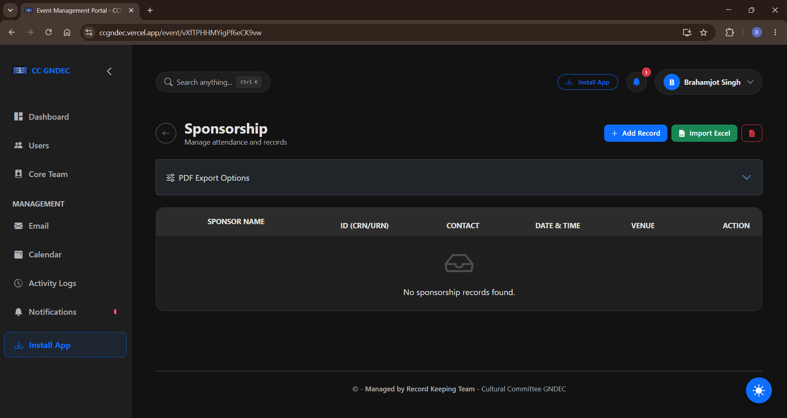  
> *Capture the sponsorship table showing company logos, pledged amounts, payment status pills, and action menus.*

---

### 5.8 Competition Participants (Regular Events)
For non-festival events, tracks items/competitions, categories (Music, Dance, Literary, Fine Arts), student entries (Name, URN, CRN, Branch), and final prize rankings (1st, 2nd, 3rd).

> 📸 **SCREENSHOT PLACEHOLDER 12: Competition Items & Participant Scoring**  
> 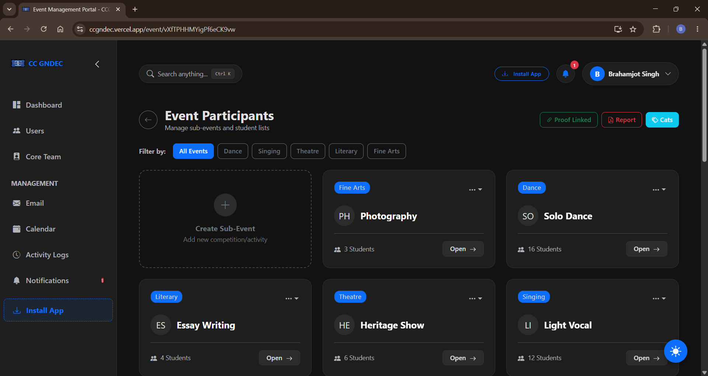  
> *Capture the item tabs with student participant lists, URN/CRN numbers, and awarded positions.*

---

### 5.9 Youth Festival Host Operations (Full Scale)
When GNDEC is the **Host College**, an advanced operations engine is activated:

1. **Colleges & In-Charges (`yf_host`)**: Register participating colleges, in-charge professors, and selected competitive items.
2. **Desk Check-in & Gate Arrivals (`yf_checkin`)**: Gate reception desk with live arrival verification, check-in timestamps, and CSV exports.
3. **Multi-Day Venue Mapping (`yf_venues`)**: Assigns venues (Auditorium, Open Air Theatre, Seminar Halls) across Day 1, Day 2, and Day 3 with start times.
4. **Hostel Accommodation (`yf_accommodation`)**: Manages room allotments across Boys & Girls hostels, occupancy capacity, and check-in/out tracking.
5. **Results & Trophies Engine (`yf_results`)**: Calculates 1st (5 pts), 2nd (3 pts), 3rd (1 pt) rankings to dynamically generate overall institutional trophies.

> 📸 **SCREENSHOT PLACEHOLDER 13: Youth Festival Host Operations Dashboard**  
> 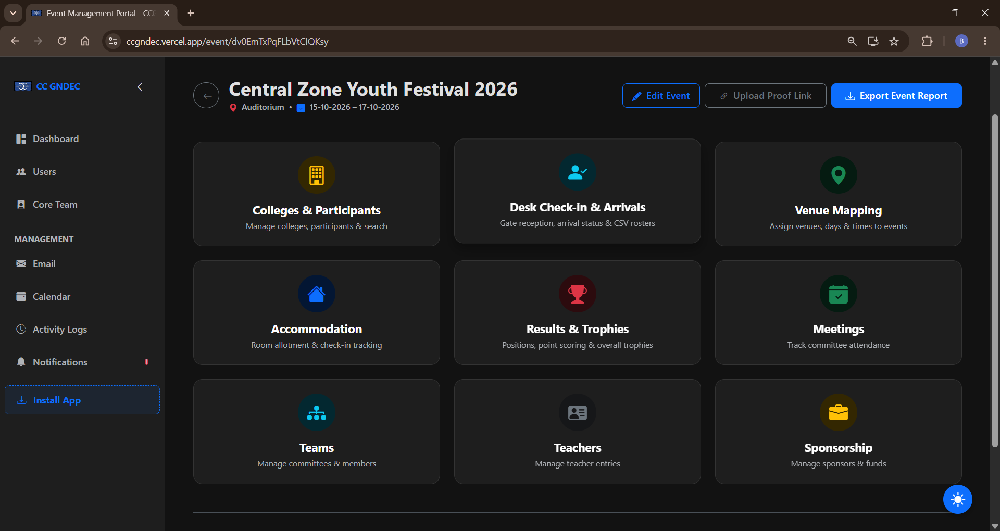  
> *Capture the grid of YF host modules (Colleges, Check-in, Venue Mapping, Accommodation, Results).*

> 📸 **SCREENSHOT PLACEHOLDER 14: Gate Check-in & Arrival Status**  
> 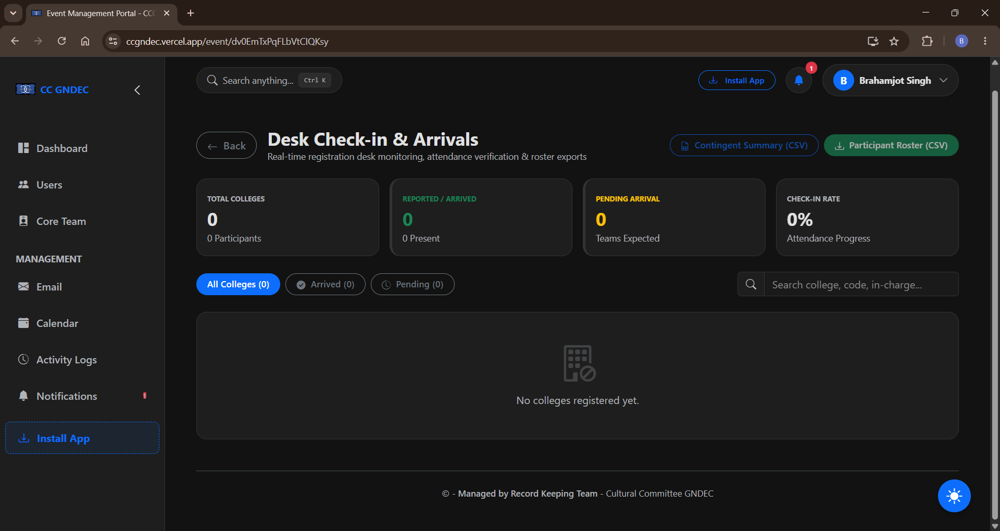  
> *Capture the live desk table with arrival checkboxes, college names, and CSV export action.*

> 📸 **SCREENSHOT PLACEHOLDER 15: Hostel Room Allotment Manager**  
> 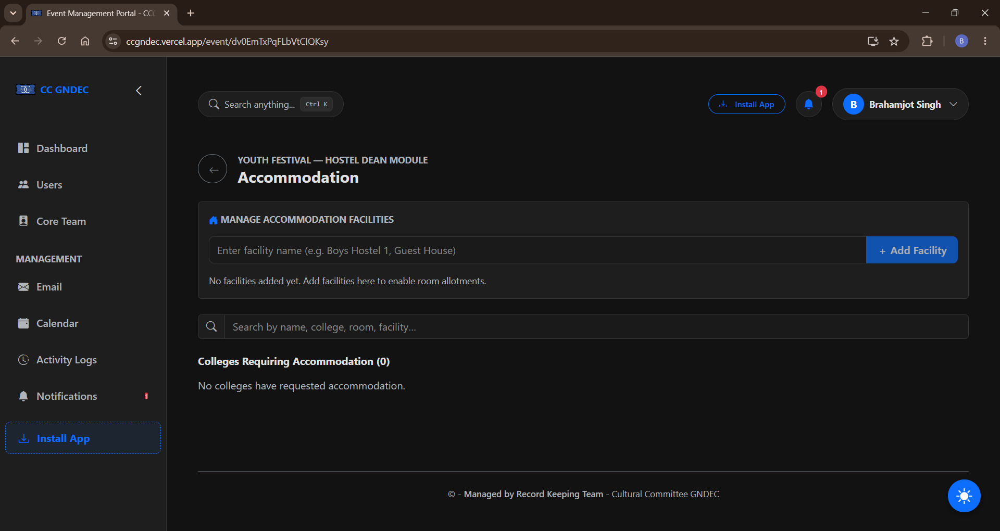  
> *Capture the hostel allotment view showing room numbers, assigned colleges, and bed occupancy bars.*

> 📸 **SCREENSHOT PLACEHOLDER 16: Youth Festival Trophy & Aggregate Results Board**  
> 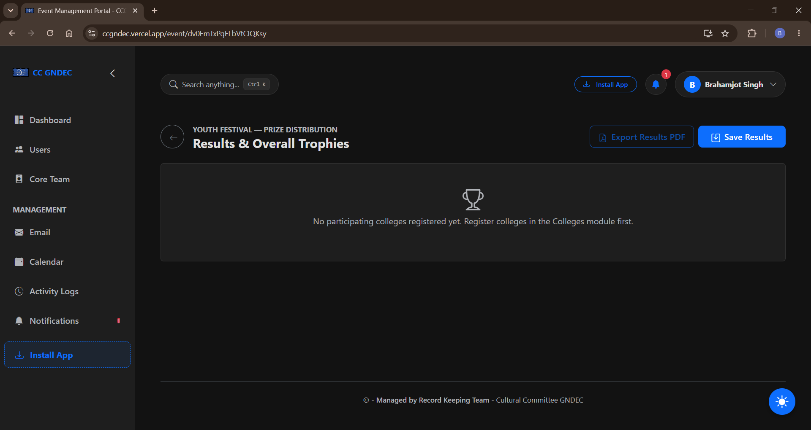  
> *Capture the official points table with college positions, points breakdown, and Overall Trophy standings.*

---

### 5.10 Youth Festival Contingent Operations
When GNDEC participates as a visiting contingent, this mode manages GNDEC's internal student roster, rehearsals, and item submissions.

> 📸 **SCREENSHOT PLACEHOLDER 17: GNDEC Contingent Roster**  
> 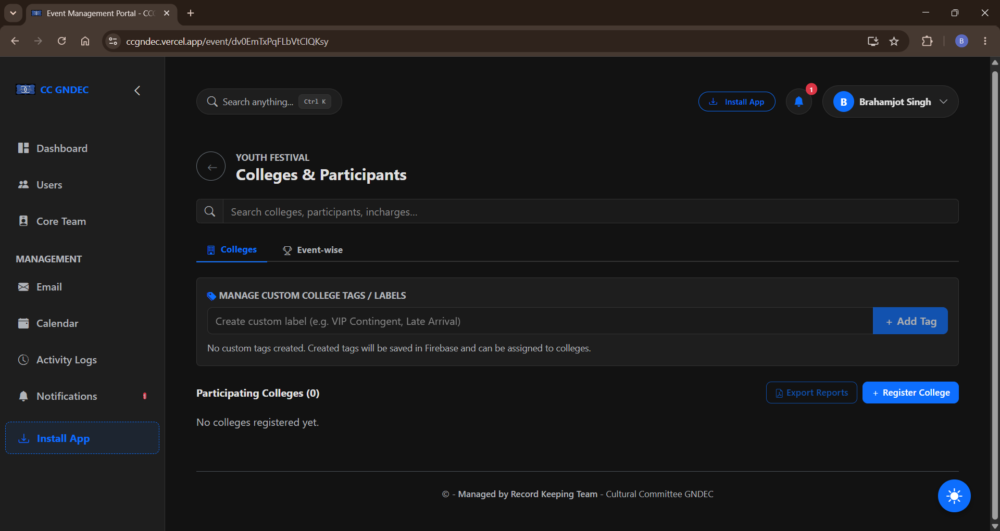  
> *Capture the contingent preparation list showing student items, categories, and accompaniment requirements.*

---

### 5.11 Automated PDF Report & Performa Engine
The portal dynamically compiles complex tabular data into publication-ready landscape PDFs via `jsPDF` and `jspdf-autotable`.

- **Comprehensive Event Report**: Includes header, proof URL link, faculty committees, teams, participants, and meetings.
- **Youth Festival Official Performas**: Boarding performa, participation performa, room allotment sheets, and official results sheets.

> 📸 **SCREENSHOT PLACEHOLDER 18: Generated PDF Report Preview**  
>   
> *Capture the exported PDF preview displaying the GNDEC Cultural Committee header and grid tables.*

---

### 5.12 Notification System & Mobile Drawer
- **Micro-Interactions**: Active trigger outline on the bell, pulsing red unread counter badge (`badge-pulse`), and smooth popover entrance (`popoverSlideIn`).
- **Responsive Mobile Bottom Sheet (`< 576px`)**: Slides up from the bottom with a blurred backdrop and swipe pill handle on mobile viewports.
- **Global Hotkey**: Press `Ctrl+Shift+N` (or `Cmd+Shift+N`) to toggle the notification dropdown from anywhere.
- **Full Notification Hub (`/notifications`)**: Grouped chronologically (*Today*, *Yesterday*, *This Week*, *Earlier*) with shimmering skeleton loaders (`placeholder-glow`).

> 📸 **SCREENSHOT PLACEHOLDER 19: Notification Dropdown & Mobile Bottom Sheet**  
>   
> *Capture the notification popover open on desktop or bottom sheet on mobile showing unread notifications.*

---

### 5.13 Broadcast Email Center
Integrated with `@emailjs/browser` to send instant broadcast announcements to participants, faculty coordinators, and student volunteers.

- **Pre-Built Templates**: Audition invitations, meeting notifications, event results announcements, and custom alerts.

> 📸 **SCREENSHOT PLACEHOLDER 20: Broadcast Email Center (`/email`)**  
>   
> *Capture the Email page showing template selectors, recipient preview, and subject/body composer.*

---

### 5.14 Event Calendar & Timeline
Interactive visual timeline (`/calendar`) showing multi-day festivals and individual events with chronological badges.

> 📸 **SCREENSHOT PLACEHOLDER 21: Event Calendar & Timeline (`/calendar`)**  
>   
> *Capture the `/calendar` timeline displaying past and upcoming event cards.*

---

### 5.15 Activity Logs & Audit Trail
An immutable audit log (`/activity-logs`) available to administrators tracking all system mutations (event creations, updates, deletions, user approvals).

> 📸 **SCREENSHOT PLACEHOLDER 22: Activity Audit Logs (`/activity-logs`)**  
>   
> *Capture the audit log table showing timestamps, performed-by user badges, and descriptive action notes.*

---

### 5.16 Productivity Tools (Command Palette, Dark Mode, PWA)
- **Command Palette (`Ctrl+K`)**: Instant search overlay to navigate routes and events with keyboard arrows and automatic auto-scrolling.
- **Profile Quick-Menu**: Header avatar popover showing user info, role badge, theme toggle, and sign out.
- **Theme Engine**: Toggle between Light Mode and Dark Mode with full CSS variable persistence.
- **PWA Installation**: Install as an offline-capable native app on desktop and mobile.

> 📸 **SCREENSHOT PLACEHOLDER 23: Command Palette (`Ctrl+K`) & Profile Popover**  
>   
> *Capture the centered Command Palette overlay with query text and keyboard navigation highlighted.*

> 📸 **SCREENSHOT PLACEHOLDER 24: Dark Mode Interface Theme**  
>   
> *Capture the dashboard rendered in Dark Mode showing high-contrast cards and primary glowing accents.*

---

## 6. Master Screenshot Guide & Asset Index

Save your screenshot image files inside the directory:
```
docs/screenshots/
```

### Screenshot Specifications & Capture Checklist:

| # | File Name | Route / Screen | State to Capture | Recommended Resolution |
| :-: | :--- | :--- | :--- | :--- |
| **01** | `01_login_screen.png` | `/login` | Centered login card with CC GNDEC logo | 1920×1080 |
| **02** | `02_pending_approval.png` | `/pending-approval` | Pending notice card for unverified user | 1920×1080 |
| **03** | `03_users_management.png` | `/users` | User table with pending approval pills | 1920×1080 |
| **04** | `04_home_dashboard.png` | `/` | Home page grid, search bar, and filter tabs | 1920×1080 |
| **05** | `05_card_dropdown_menu.png` | `/` | 3-dots dropdown menu open on an event card | 1280×720 (or crop) |
| **06** | `06_edit_event_modal.png` | `/` | Edit Event modal open with pre-filled fields | 1280×720 (or crop) |
| **07** | `07_event_dashboard.png` | `/event/:id` | Event header with "Edit Event" & module cards | 1920×1080 |
| **08** | `08_meetings_attendance.png` | `/event/:id` (Meetings) | Meeting card with student attendance list | 1920×1080 |
| **09** | `09_teams_committees.png` | `/event/:id` (Teams) | Committee cards with student heads & roles | 1920×1080 |
| **10** | `10_faculty_teachers.png` | `/event/:id` (Teachers) | Faculty coordinators categorized by committee | 1920×1080 |
| **11** | `11_sponsorship_tracker.png` | `/event/:id` (Sponsors) | Sponsorship table with funds & status pills | 1920×1080 |
| **12** | `12_participants_scoring.png` | `/event/:id` (Participants) | Student competition entries & awarded ranks | 1920×1080 |
| **13** | `13_yf_host_dashboard.png` | `/event/:id` (YF Host) | YF Host modules overview grid | 1920×1080 |
| **14** | `14_yf_checkin_desk.png` | `/event/:id` (Check-in) | Gate desk table with arrival checkboxes | 1920×1080 |
| **15** | `15_yf_accommodation.png` | `/event/:id` (Rooms) | Hostel rooms allotment & occupancy bars | 1920×1080 |
| **16** | `16_yf_results_trophies.png` | `/event/:id` (Results) | College aggregate points & Trophy board | 1920×1080 |
| **17** | `17_yf_contingent_roster.png` | `/event/:id` (Contingent) | GNDEC visiting contingent roster table | 1920×1080 |
| **18** | `18_pdf_report_preview.png` | PDF Reader / Browser | Exported landscape Event Report PDF | 1920×1080 |
| **19** | `19_notifications_popover.png` | Anywhere (`Ctrl+Shift+N`) | Notification popover open showing date groups | 1280×720 (or crop) |
| **20** | `20_broadcast_email.png` | `/email` | Email composer with template selected | 1920×1080 |
| **21** | `21_event_calendar.png` | `/calendar` | Event timeline with upcoming/past badges | 1920×1080 |
| **22** | `22_activity_logs.png` | `/activity-logs` | Activity audit log table with action tags | 1920×1080 |
| **23** | `23_command_palette.png` | Anywhere (`Ctrl+K`) | Command palette overlay with search query | 1920×1080 |
| **24** | `24_dark_mode_view.png` | `/` | Home dashboard rendered in Dark Mode | 1920×1080 |

### Tips for High-Quality Captures:
1. **Browser Zoom**: Keep browser zoom at 100% (default) so font crispness and padding match the layout design.
2. **Data Consistency**: Use clean sample event names (e.g. *"IKGPTU Inter-Zonal Youth Festival 2026"*, *"Anand Utsav Cultural Fest"*).
3. **Theme Uniformity**: For screenshots 01 through 23, capture in **Light Mode** (or consistently in **Dark Mode**), reserving screenshot 24 specifically to demonstrate the Dark/Light contrast.
4. **Asset Format**: Save images as standard `.png` files to maintain clean text edges and transparent rounded borders.
